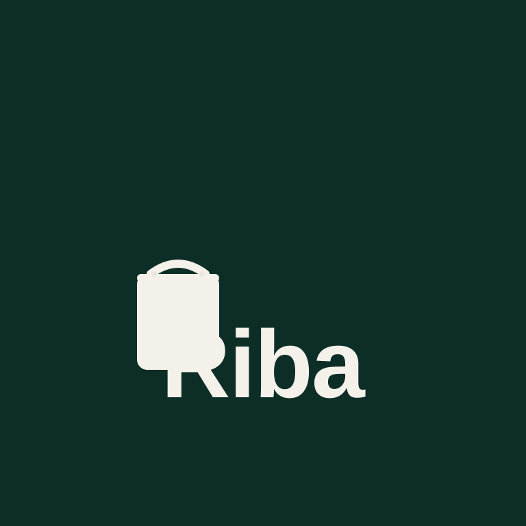

# RIBA - Quick Menu & Cart Creator

<div align="center">
  
  
  ### Mobile-first store builder for Nigerian businesses
  
  [](https://github.com/zortojnr/riba-marketplace)
  [](LICENSE)
  [](https://reactjs.org/)
  [](https://www.typescriptlang.org/)
</div>

## 🚀 Overview

RIBA is a comprehensive mobile-first store builder designed specifically for Nigerian businesses. It enables quick menu and cart creation with seamless sharing capabilities, making it perfect for restaurants, retail stores, and service providers.

## ✨ Features

- **🔐 Secure Authentication**: Email/password login with Google Sign-In support
- **📱 Progressive Web App**: Installable on mobile devices with offline capabilities
- **🛍️ Store Management**: Create and manage your online store with ease
- **📋 Menu/Cart Creation**: Build interactive menus and shopping carts
- **📤 Sharing Features**: QR codes, digital flyers, and social media sharing
- **🎨 Customizable Themes**: Personalize your store with custom colors and branding
- **📊 Order Management**: Track and manage customer orders efficiently
- **🔔 Real-time Notifications**: Stay updated with customer activities

## 🛠️ Tech Stack

- **Frontend**: React 18 + TypeScript + Vite
- **Styling**: Tailwind CSS v3
- **State Management**: Zustand + React Context
- **Forms**: React Hook Form + Zod validation
- **Animations**: Framer Motion
- **Icons**: Lucide React
- **Build Tool**: Vite
- **Package Manager**: npm/pnpm

## 📦 Installation

### Prerequisites

- Node.js 18+ 
- npm or pnpm

### Quick Start

1. **Clone the repository**
   ```bash
   git clone https://github.com/zortojnr/riba-marketplace.git
   cd riba-marketplace
   ```

2. **Install dependencies**
   ```bash
   npm install
   # or
   pnpm install
   ```

3. **Start development server**
   ```bash
   npm run dev
   # or
   pnpm dev
   ```

4. **Build for production**
   ```bash
   npm run build
   # or
   pnpm build
   ```

## 🎯 Usage

### For Store Owners

1. **Sign Up**: Create your account with email or Google Sign-In
2. **Onboarding**: Complete the business setup process
3. **Create Store**: Set up your online store with custom branding
4. **Add Products**: Build your menu or product catalog
5. **Share Store**: Generate QR codes and share on social media
6. **Manage Orders**: Track customer orders and manage inventory

### For Customers

1. **Browse Stores**: Discover local businesses
2. **View Menus**: Browse products and services
3. **Add to Cart**: Build your order
4. **Place Orders**: Submit orders directly to store owners
5. **Track Status**: Monitor order progress

## 🏗️ Project Structure

```
riba-marketplace/
├── src/
│   ├── components/          # Reusable UI components
│   │   ├── auth/           # Authentication components
│   │   ├── layout/         # Layout components (Header, Footer)
│   │   ├── store/          # Store-related components
│   │   ├── sharing/        # Sharing features (QR, flyers)
│   │   └── ui/             # Basic UI components
│   ├── contexts/            # React Context providers
│   ├── hooks/               # Custom React hooks
│   ├── pages/               # Page components
│   ├── types/               # TypeScript type definitions
│   ├── utils/               # Utility functions
│   └── assets/              # Static assets
├── assets/
│   └── images/              # Logo and brand assets
├── public/                  # Public assets and PWA files
└── supabase/               # Database configuration
```

## 🎨 Brand Assets

The RIBA brand identity includes:

- **Logo**: Shopping bag icon with "Riba" text
- **Colors**: Dark green (#0D2E27) with cream/off-white accents (#F3F1EA)
- **Typography**: Modern, rounded sans-serif font
- **Iconography**: Custom shopping bag design with handle and rivet details

Logo files are located in `/assets/images/` and include:
- `logo.svg` - Full-size logo (768x768px)
- `logo-transparent.svg` - Transparent version
- PWA icons in `/public/` (192x192 and 512x512)

## 🔧 Configuration

### Environment Variables

Create a `.env` file in the root directory:

```env
VITE_APP_NAME=RIBA
VITE_APP_URL=http://localhost:5173
VITE_SUPABASE_URL=your_supabase_url
VITE_SUPABASE_ANON_KEY=your_supabase_anon_key
```

### PWA Configuration

The app includes Progressive Web App features configured in:
- `public/manifest.json` - App manifest
- `public/icon-*.svg` - PWA icons
- Service worker configuration in `vite.config.ts`

## 🚀 Deployment

### Vercel (Recommended)

1. Connect your GitHub repository to Vercel
2. Configure build settings:
   - Framework: Vite
   - Build Command: `npm run build`
   - Output Directory: `dist`

### Other Platforms

The app can be deployed to any static hosting platform:
- Netlify
- GitHub Pages
- Firebase Hosting
- AWS S3 + CloudFront

## 🤝 Contributing

1. Fork the repository
2. Create a feature branch (`git checkout -b feature/amazing-feature`)
3. Commit your changes (`git commit -m 'Add amazing feature'`)
4. Push to the branch (`git push origin feature/amazing-feature`)
5. Open a Pull Request

## 📝 License

This project is licensed under the MIT License - see the [LICENSE](LICENSE) file for details.

## 🙏 Acknowledgments

- Built with modern web technologies for optimal performance
- Designed with Nigerian businesses in mind
- Inspired by the need for simple, effective e-commerce solutions
- Logo design based on shopping bag concept with custom typography

## 📞 Support

For support, email support@riba.ng or join our community discussions.

---

<div align="center">
  <strong>Made with ❤️ for Nigerian businesses</strong>
</div>
